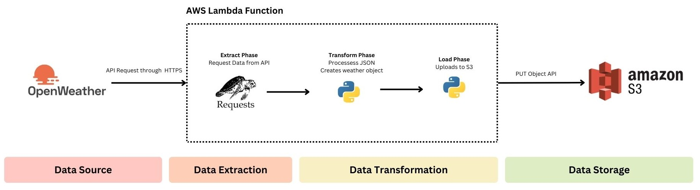

# 🌦️Mini ETL Pipeline with OpenWeather API and AWS S3

## 📌Introduction
This project demonstrates a lightweight ETL (Extract, Transform, Load) pipeline using Python and cloud technologies. The script fetches real-time weather data from the OpenWeatherMap API, processes it to extract key metrics, and uploads the results to an AWS S3 bucket in JSON format.

It’s designed to be deployable in a cloud function environment (e.g., AWS Lambda), showcasing key skills in API integration, cloud storage, and error handling.

## 🛠Technology Used
  

## ⚙️Architecture

## 🔁ETL Flow
Extract – Fetch weather data for a specific city (Pasig by default).

Transform – Parse and format relevant weather attributes (e.g., temperature, humidity).

Load – Upload the structured JSON file to a specified AWS S3 bucket.

## 🚨 Error Handling
The script includes detailed error handling for reliability and traceability:

- HTTPError – Handles HTTP issues from the OpenWeather API.

- RequestException – Catches generic request-level errors (e.g., connection issues).

- ClientError – Handles AWS S3 operation failures (e.g., permissions, missing buckets).

- BotoCoreError – Catches low-level AWS SDK exceptions.

- Generic Exception – Catches all other unexpected issues gracefully.
